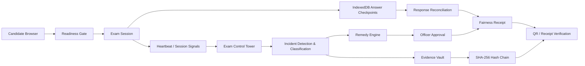
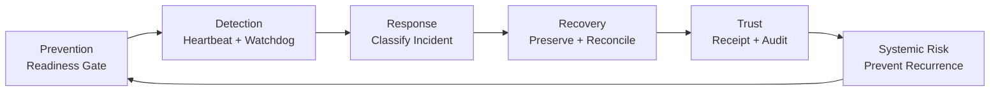

::: {align="center"}
``{=html}

# ExamShield

### Fair Exams. Trusted Results.

**Prevention → Detection → Response → Recovery → Trust**
:::

------------------------------------------------------------------------

> **ExamShield is an evidence-driven resilience layer for online
> examinations: it prevents unsafe exam starts, detects session
> disruptions, preserves candidate work, recommends proportionate
> recovery, and generates verifiable evidence for fair, officer-approved
> decisions.**


# ExamShield

A browser exam platform built around one idea: when an exam session is
disrupted, prove what happened, pause the candidate's clock, keep every
answer, and give a fair, officer-approved, verifiable remedy.

## Run

``` bash
npm install
cp .env.example .env
npm run dev
```

  --------------------------------------------------------------------------------
  URL                                          Who
  -------------------------------------------- -----------------------------------
  `http://localhost:5190/`                     Landing page

  `http://localhost:5190/exam`                 Candidate exam

  `http://localhost:5190/ops`                  Exam Control Tower

  `http://localhost:5190/verify?r=<receipt>`   Fairness Receipt verification
  --------------------------------------------------------------------------------

## Architecture

### High-level flow



### Resilience lifecycle



### Core components

  -----------------------------------------------------------------------
  Component                           Responsibility
  ----------------------------------- -----------------------------------
  Candidate App                       Readiness, exam, checkpointing,
                                      recovery UX

  Control Tower                       Live sessions, incidents, affected
                                      cohort, officer workflow

  IndexedDB                           Local-first answer preservation

  Heartbeat / Watchdog                Session health and outage detection

  Incident Engine                     Individual vs shared outage
                                      classification

  Remedy Engine                       Recover / Protect Time / Targeted
                                      Reschedule

  Evidence Vault                      Event history, hash chain, export
                                      and tamper test

  Fairness Receipt                    Incident, impact, remedy, reason,
                                      officer and verification hash

  Systemic Risk Layer                 Correlates repeated failure
                                      signatures and recommends
                                      prevention
  -----------------------------------------------------------------------

## What a candidate goes through

1.  **Login** with Candidate ID + date of birth.
2.  **Instructions**: section table, rules, language and declaration.
3.  **Readiness Gate** verifies the paper/version, language pack, timer
    drift, IndexedDB save channel and exam-server heartbeat before the
    timer starts.
4.  **Exam** with answer checkpoints written locally first and
    reconciled with the server.
5.  **BlurShield** keeps the focused area readable while a rotating
    session/time watermark remains visible.
6.  **Integrity signals** are review-only and are never used for
    automatic penalties.
7.  **Submit** creates a response digest and any applicable Fairness
    Receipt.

## Disruptions: detect → pause → preserve → remedy → receipt

-   **Detection:** the candidate browser sends a heartbeat every 2
    seconds; the Control Tower watchdog detects silent sessions.
-   **Pause:** when the connection is lost, the candidate timer freezes
    and resumes from the same value.
-   **Preserve:** answers remain safe in IndexedDB and queued saves
    reconcile after recovery.
-   **Correlation:** multiple PCs losing heartbeat in the same service
    window are classified as a shared outage.
-   **Remedy:** the engine recommends `Recover`, `Protect Time`, or
    `Targeted Reschedule`; high-stakes actions require officer approval.
-   **Evidence:** events are sealed with SHA-256 and chained; the
    affected candidate receives a verifiable Fairness Receipt.

## Remedy Engine

  -----------------------------------------------------------------------
  Situation                           Recommendation
  ----------------------------------- -----------------------------------
  Short individual interruption       `Recover`

  Longer or shared interruption       `Protect Time`

  Severe interruption / unreconciled  `Targeted Reschedule`
  answers / insufficient remaining    
  time                                
  -----------------------------------------------------------------------

**No marks are automatically changed.** High-stakes remedies require
officer approval.

## Evidence & Trust

Every important event contributes to a SHA-256 hash chain.

The Fairness Receipt records:

-   Incident ID
-   Measured interruption interval
-   Answers preserved
-   Remedy
-   Decision reason
-   Officer approval
-   Receipt hash
-   Evidence-chain head
-   QR verification link

If a recorded event is edited, verification fails.

## Challenge Alignment --- 12 Resilience Points

  -----------------------------------------------------------------------
  \#                      Challenge point         ExamShield capability
  ----------------------- ----------------------- -----------------------
  1                       Real-time monitoring    Candidate heartbeat,
                                                  session state and
                                                  Control Tower

  2                       Early detection &       Readiness gate +
                          prediction              heartbeat/watchdog
                                                  signals

  3                       Incident detection,     Individual/shared
                          classification &        incident correlation +
                          escalation              officer escalation

  4                       Backup & disaster       IndexedDB-first
                          recovery                checkpoints and
                                                  recovery across session
                                                  interruption

  5                       Tamper-evident storage  SHA-256 event hash
                                                  chain + receipt hash

  6                       Suspicious pattern      Review-only integrity
                          detection               signals and incident
                                                  correlation

  7                       Response reconciliation Queued answer
                          & validation            reconciliation,
                                                  sequence numbers and
                                                  response digest

  8                       Candidate communication Offline status,
                                                  incident banners,
                                                  recovery state and
                                                  receipt

  9                       Reschedule / re-conduct Recover / Protect Time
                          decision support        / Targeted Reschedule
                                                  policy

  10                      Fairness & consistency  Measured interruption
                                                  interval, targeted
                                                  remedy and officer
                                                  approval

  11                      Audit trail & evidence  Evidence Vault, session
                          reporting               report, export and
                                                  candidate receipt

  12                      AI analytics for        Repeated failure
                          systemic risks &        signatures → preventive
                          recurrence prevention   recommendation
  -----------------------------------------------------------------------

## AI proctoring

The current implementation can use Claude vision for review-only
integrity observations. Frames are processed server-side and are not
stored by the application. These signals support officer review; they do
not perform biometric identity verification or automatic punishment.

## Develop

``` bash
npm test
npm run build
```

  -----------------------------------------------------------------------
  Path                                What
  ----------------------------------- -----------------------------------
  `src/lib/core.ts`                   Types, hash chain, receipt
                                      verification, multi-PC merge,
                                      remedy engine and timer

  `src/state.ts`                      Sync, IndexedDB, heartbeat,
                                      watchdog and actions

  `src/candidate.tsx`                 Login, readiness gate, exam and
                                      submit

  `src/ops.tsx`                       Control Tower, incidents, remedies
                                      and evidence vault

  `server/proctor.ts`                 Heartbeat and AI-proctor API

  `vite.config.ts`                    Dev server and LAN mode
  -----------------------------------------------------------------------

## Honest boundaries

-   The MVP demonstrates **software-session resilience**.
-   It does not claim CCTV, biometric identity verification,
    physical-centre telemetry, power-grid monitoring or guaranteed
    screenshot prevention.
-   Production deployment would add an authenticated backend-owned
    session store, officer authentication and server-side receipt
    signing.
-   Integrity signals are review-only and should not be treated as proof
    of misconduct by themselves.

## Core idea

> **When an online exam fails, make the failure measurable, the recovery
> fair, and the evidence trustworthy.**
