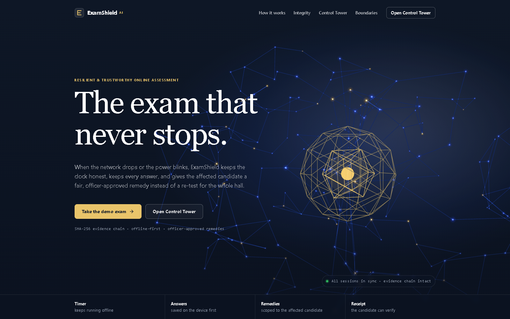
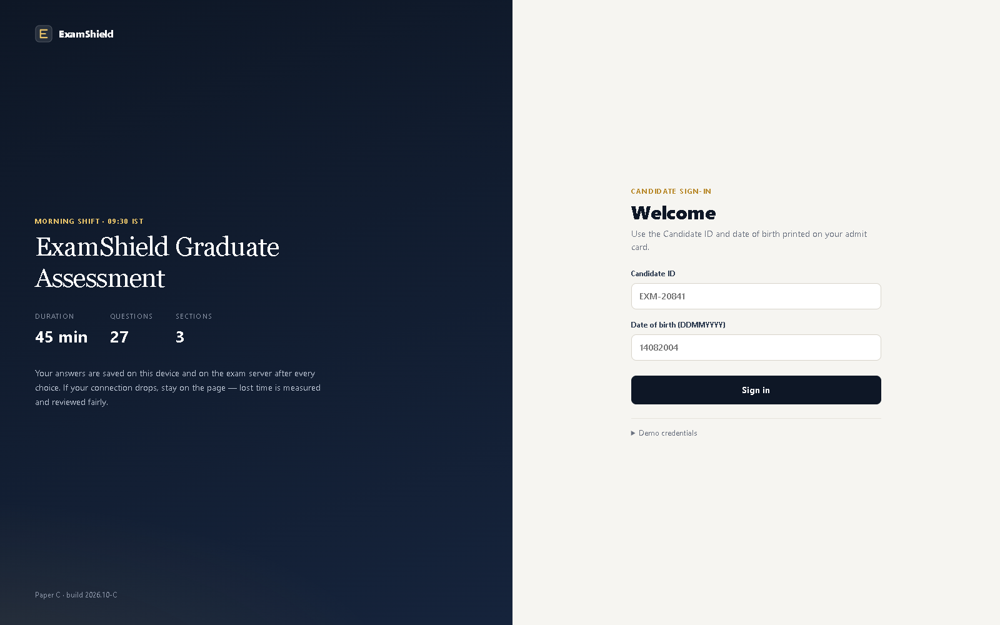
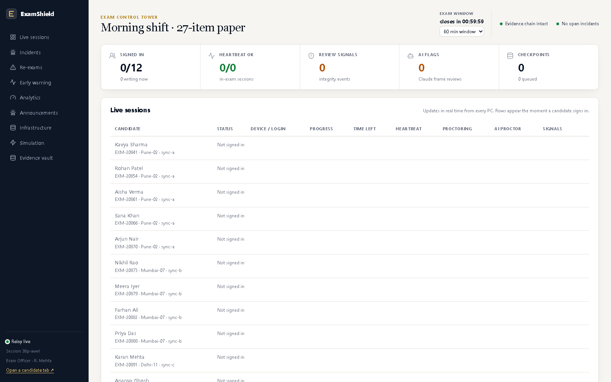
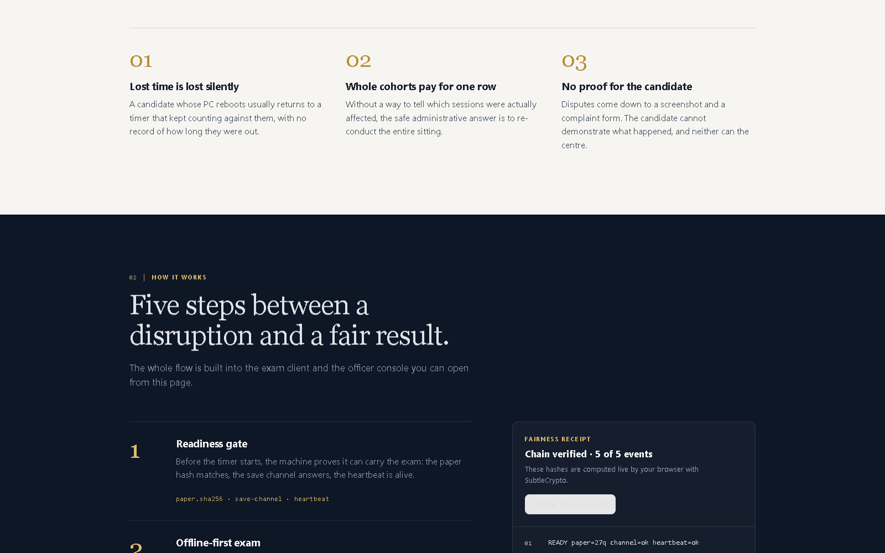
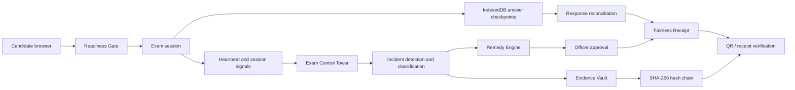
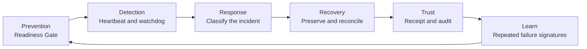

<p align="center">
  
</p>

<h1 align="center">ExamShield</h1>

<p align="center">
  <strong>Fair Exams. Trusted Results.</strong><br />
  <em>Prevention - Detection - Response - Recovery - Trust</em>
</p>

<p align="center">
  
  
  
  
</p>

<p align="center">
  <a href="#the-idea">The idea</a> &bull;
  <a href="#product-views">Product views</a> &bull;
  <a href="#architecture">Architecture</a> &bull;
  <a href="#run-locally">Run locally</a> &bull;
  <a href="#honest-boundaries">Boundaries</a>
</p>

> **ExamShield is an evidence-driven resilience layer for online examinations.** It prevents unsafe exam starts, detects session disruptions, preserves candidate work, recommends proportionate recovery, and generates verifiable evidence for fair, officer-approved decisions.

<p align="center">
  
</p>

## The idea

An exam disruption should not automatically become a re-test for an entire hall - or an unprovable complaint for one candidate.

ExamShield is a browser exam platform built around one principle: **when a session is disrupted, keep the candidate answering offline, preserve every answer, measure what happened, and provide a fair, officer-approved, verifiable remedy.**

| What matters | How ExamShield responds |
| --- | --- |
| **A safe start** | A Readiness Gate checks the paper/version, language pack, timer drift, IndexedDB save channel, and exam-server heartbeat before the timer starts. |
| **Continuity** | Answers are checkpointed to IndexedDB first and reconciled with the server after recovery. |
| **Measured impact** | Heartbeats and a Control Tower identify individual and shared service disruptions. |
| **A proportionate decision** | The Remedy Engine recommends `Recover`, `Protect Time`, or `Targeted Reschedule`; high-stakes outcomes require officer approval. |
| **Trust after the incident** | A SHA-256 evidence chain and candidate-visible Fairness Receipt make the record verifiable. |

## Product views

<table>
  <tr>
    <td width="50%" valign="top"><strong>Candidate experience</strong><br /><sub>Sign in to a 27-question assessment with a clear, familiar exam flow.</sub><br /><br /></td>
    <td width="50%" valign="top"><strong>Exam Control Tower</strong><br /><sub>Live session, heartbeat, checkpoint, signal, and incident visibility for exam officers.</sub><br /><br /></td>
  </tr>
</table>

<p align="center">
  
</p>

## Architecture

### From candidate session to verifiable receipt



### The resilience lifecycle



### Core components

| Component | Responsibility |
| --- | --- |
| **Candidate App** | Readiness, instructions, exam flow, answer checkpointing, recovery UX, and submission. |
| **Control Tower** | Live sessions, incidents, affected cohort visibility, officer workflow, and the Evidence Vault. |
| **IndexedDB** | Local-first answer preservation and queued saves while connectivity is unavailable. |
| **Heartbeat / Watchdog** | Session health signals and detection of silent or unavailable sessions. |
| **Incident Engine** | Individual-versus-shared outage classification and escalation context. |
| **Remedy Engine** | `Recover`, `Protect Time`, and `Targeted Reschedule` recommendations. |
| **Evidence Vault** | Event history, SHA-256 chain status, export, and tamper testing. |
| **Fairness Receipt** | Incident, measured impact, decision reason, officer, and verification data. |

## Candidate experience

ExamShield is designed to feel like an actual assessment, not a static dashboard.

| Step | Candidate experience | What is protected |
| --- | --- | --- |
| 1 | **Login** with Candidate ID and date of birth. | A candidate-specific exam session. |
| 2 | Review **Instructions**, sections, rules, language, and declaration. | Clear expectations before the paper begins. |
| 3 | Complete the **Readiness Gate** before the timer starts. | Paper integrity, save-channel availability, and session health. |
| 4 | Take the exam using the question palette, Save & Next, Mark for Review, and coding templates. | Every answer is checkpointed locally first. |
| 5 | Work with **BlurShield** and a rotating session/time watermark. | The focused area stays readable while the sensitive layer is protected. |
| 6 | Receive clear offline, recovery, and incident status. | The candidate can continue answering while queued saves await reconciliation. |
| 7 | Submit and receive a response digest and, when applicable, a **Fairness Receipt**. | A record the candidate can verify. |

### Integrity signals are never automatic penalties

The implementation can record fullscreen exits, tab/focus loss, copy/cut/paste/right-click/drag activity, camera loss or obstruction, and optional AI-proctor observations. These are **review-only signals** for an officer - not proof of misconduct, not automatic disqualification, and never an automatic mark change.

## Resilience and recovery

### Detect -> keep working -> preserve -> remedy -> receipt

```mermaid
sequenceDiagram
    participant C as Candidate browser
    participant L as IndexedDB
    participant T as Control Tower
    participant O as Exam officer
    participant V as Receipt verification

    C->>L: Checkpoint each answer locally
    C->>T: Send heartbeat and session signals
    Note over C: Connectivity is lost; the timer keeps running offline
    C->>L: Keep answers safe; queue sync work
    T->>T: Watchdog detects and classifies impact
    C->>T: Reconcile checkpoints after recovery
    T->>O: Recommend the smallest fair remedy
    O->>T: Approve high-stakes remedy
    T->>V: Issue Fairness Receipt with evidence-chain head
```

### Remedy Engine

| Situation | Recommendation | Decision rule |
| --- | --- | --- |
| Short individual interruption | `Recover` | Resume and reconcile the preserved work. |
| Longer or shared interruption | `Protect Time` | Use the measured interruption evidence to protect fairness. |
| Severe interruption, unreconciled answers, or insufficient remaining time | `Targeted Reschedule` | Re-schedule only affected candidate(s), not the whole cohort by default. |

**No marks are automatically changed.** High-stakes remedies require officer approval.

## Evidence and the Fairness Receipt

Every important event contributes to a SHA-256 hash chain. The candidate-facing Fairness Receipt makes the operational record inspectable instead of relying on a screenshot or a complaint alone.

| The receipt records | Why it matters |
| --- | --- |
| Incident ID and measured interruption interval | Establishes what happened and for how long. |
| Answers preserved and response reconciliation | Shows whether candidate work survived the interruption. |
| Remedy and decision reason | Makes the remedy reviewable and proportionate. |
| Officer approval | Keeps consequential decisions human-accountable. |
| Receipt hash and evidence-chain head | Provides a verifiable link to the recorded evidence. |
| QR verification link | Lets a recipient open the receipt-verification view. |

If a recorded event is edited, chain verification fails.

## Challenge alignment - 12 resilience points

The project follows the MPOnline challenge framing across the assessment lifecycle, while being explicit about MVP limits.

| # | Challenge point | ExamShield capability |
| ---: | --- | --- |
| 1 | Real-time monitoring | Candidate heartbeat, session state, and the Control Tower. |
| 2 | Early detection and prediction | Readiness Gate plus heartbeat/watchdog signals; this is early detection, not a claim of a full predictive model. |
| 3 | Incident detection, classification, and escalation | Individual/shared outage correlation and officer escalation. |
| 4 | Backup and disaster recovery | IndexedDB-first checkpoints, queued saves, and recovery across session interruption. |
| 5 | Tamper-evident storage | SHA-256 event hash chain, receipt hash, and tamper verification. |
| 6 | Suspicious-pattern detection | Review-only integrity signals and incident correlation. |
| 7 | Response reconciliation and validation | Queued answer reconciliation, sequence-aware checkpoints, and response digest. |
| 8 | Candidate communication | Offline status, incident banners, recovery state, and candidate receipt. |
| 9 | Reschedule / re-conduct decision support | `Recover` / `Protect Time` / `Targeted Reschedule` policy guidance. |
| 10 | Fairness and consistency | Measured interruption interval, targeted remedy, and officer approval. |
| 11 | Audit trail and evidence reporting | Evidence Vault, session reporting, export, and Fairness Receipt. |
| 12 | AI analytics for systemic risks and recurrence prevention | Repeated failure signatures feed preventive recommendations; not a completed predictive-analytics system. |

## Technology

<p align="center">
  
  
  
  
  
  
  
  
</p>

<p align="center"><sub>A deliberate mix of resilient browser storage, real-time coordination, human-reviewed signals, and verifiable evidence.</sub></p>

| Layer | Stack / approach |
| --- | --- |
| Client | React, TypeScript, and Vite |
| Local resilience | IndexedDB, queued synchronization, and response reconciliation |
| Real-time coordination | HTTP heartbeat, watchdog, WebSocket relay, and Control Tower |
| Evidence | SHA-256 event chain, receipt verification, QR codes, and exportable evidence |
| Assessment | Multi-section paper, question palette, English/Hindi UI, JavaScript and Python coding tasks |
| Integrity | Browser signals, camera/mic and fullscreen checks, BlurShield, and watermarking |
| AI review | Optional Claude vision observations processed server-side; frames are not stored by the application |
| Visual experience | Three.js landing hero and a responsive candidate/operations interface |

## Run locally

### Prerequisites

- Node.js 20+
- A current desktop browser
- Optional: an Anthropic API key for the AI-proctoring demo

### Start the app

```bash
npm install
cp .env.example .env
npm run dev
```

On Windows PowerShell, use the following instead of `cp`:

```powershell
Copy-Item .env.example .env
```

| URL | Experience |
| --- | --- |
| `http://localhost:5190/` | Landing page and product story |
| `http://localhost:5190/exam` | Candidate assessment |
| `http://localhost:5190/ops` | Exam Control Tower |
| `http://localhost:5190/verify?r=<receipt>` | Fairness Receipt verification |

### Run an exam hall on a LAN

```bash
npm run dev:lan
```

This exposes the app at `https://<this-machine-ip>:5190` using a self-signed certificate. Each candidate PC needs HTTPS for camera access, so accept the certificate warning once on each machine. Every signed-in PC then appears in `/ops`.

### Demo credentials

| Candidate ID | Date of birth |
| --- | --- |
| `EXM-20841` | `14082004` |
| `EXM-20854` | `02112003` |
| `EXM-20873` | `17072004` |
| `EXM-20891` | `19092003` |

The full demo roster is defined in `src/data/paper.ts`.

## Demo checklist

<p align="center">
  
  
  
  
  
</p>

1. Open `/exam` and sign in with a demo candidate.
2. Walk through instructions and show the Readiness Gate before starting the paper.
3. Save a few answers, then open `/ops` in another tab to show the live session.
4. Use the Control Tower's simulation controls to demonstrate an interruption and recovery.
5. Verify that local checkpoints reconcile and inspect the incident/evidence record.
6. Show the officer-approved remedy and open the generated Fairness Receipt.
7. Scan or open the receipt verification link and run the tamper check.

## Development

```bash
npm test
npm run build
```

| Path | What it contains |
| --- | --- |
| `src/lib/core.ts` | Types, hash chain, receipt verification, multi-PC merge, Remedy Engine, and timer logic. |
| `src/state.ts` | Synchronization, IndexedDB, heartbeat, watchdog, and session actions. |
| `src/candidate.tsx` | Login, instructions, Readiness Gate, exam flow, and submit. |
| `src/ops.tsx` | Control Tower, incidents, remedies, and Evidence Vault. |
| `src/hooks/useIntegrity.ts` | Camera/mic, live-presence, fullscreen, obstruction checks, and AI-proctor loop. |
| `src/lib/runner.ts` | JavaScript and Python coding-task runners. |
| `server/proctor.ts` | Heartbeat and optional AI-proctor API. |
| `vite.config.ts` | Dev server, relay, and HTTPS LAN mode. |

## Contributors

<p align="center">
  <a href="https://github.com/shaunmortal">
    <br />
    <sub><b>Ayush Kumar</b></sub>
  </a>
  &nbsp;&nbsp;&nbsp;
  <a href="https://github.com/Cod4Nitish">
    <br />
    <sub><b>Nitish Singh</b></sub>
  </a>
  &nbsp;&nbsp;&nbsp;
  <a href="https://github.com/harsh-1-code">
    <br />
    <sub><b>Harsh Kumar</b></sub>
  </a>
</p>

<p align="center">
  <a href="https://github.com/shaunmortal"></a>
  <a href="https://github.com/Cod4Nitish"></a>
  <a href="https://github.com/harsh-1-code"></a>
</p>

<p align="center">
  <a href="https://github.com/shaunmortal/online-assessment/graphs/contributors"></a>
</p>

## Honest boundaries

- This is an MVP demonstrating **software-session resilience**, not a claim of complete physical-centre monitoring.
- It does not claim CCTV, biometric identity verification, physical-centre telemetry, power-grid monitoring, or guaranteed screenshot prevention.
- Browser-side integrity signals and AI observations are review-only; they should never be treated as proof of misconduct on their own.
- A production deployment needs hardened authentication and roles, a backend-owned durable session store, policy and accessibility review, and independently managed evidence/signing infrastructure.

---

<p align="center">
  <strong>When an online exam fails, make the failure measurable, the recovery fair, and the evidence trustworthy.</strong>
</p>
